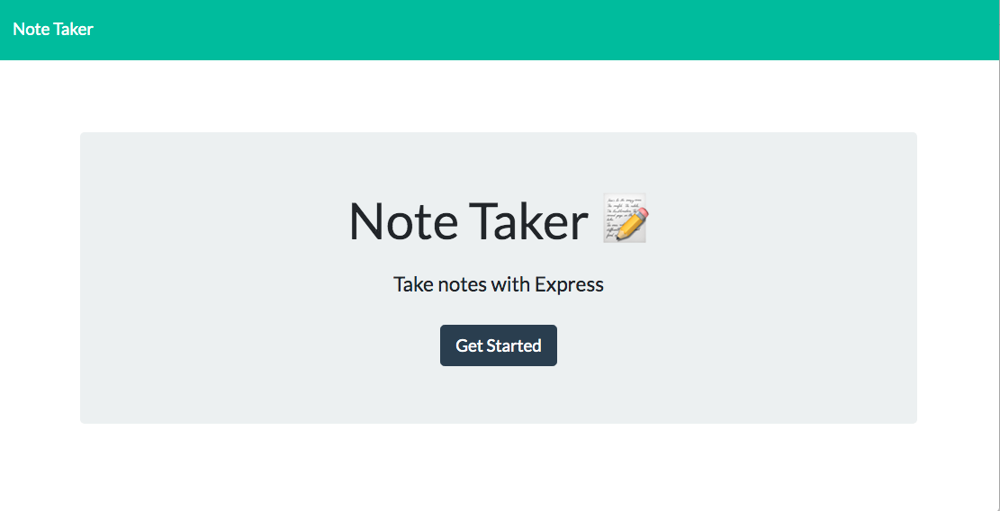

# note-taker-repo

The Note Taker is an app that uses an Express backend to save, retrieve, and delete notes from a JSON file. I have attached a screenshot of the homepage to show how the app is formatted.

