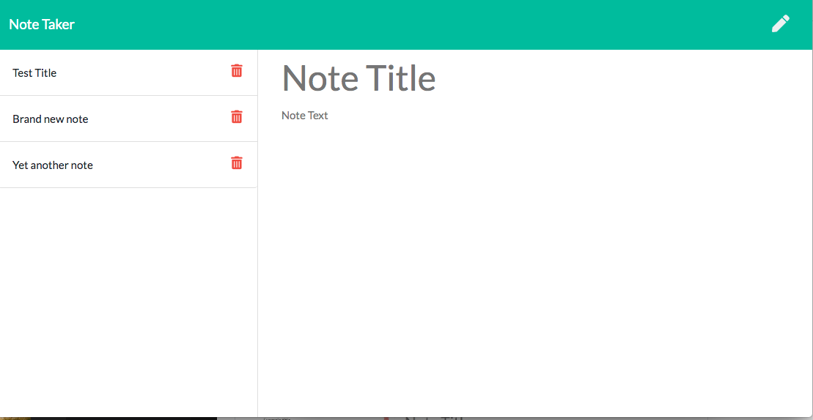

# note-taker-repo

The Note Taker is an app that uses an Express backend to save, retrieve, and delete notes from a JSON file. I have attached a screenshot of the homepage to show how the app is formatted.

Once home page, once the user clicks "Get Started" the app navigates to the notes page.

On this page you can create new notes and delete existing ones.

Below I have an example of the note page with a few test notes present.

To save the notes you click the save icon on the top right and to begin new notes you click on the pencil icon just to the right of the save icon.

Below I have a screenshot of 2 notes deleted from the previous screenshot and the beginning of a new note after clicking the pencil.

Methods of execution for this assignment:

The HTML, CSS, and frontend JavaScript were provided on this HW.

Students were tasked with providing the backend code defining all routes used to make the app work. We used Express to handle routing for GET, POST, and DELETE requests. Node FS module is used to read the JSON file containing the saved notes, and then updates the JSON file when notes are added or deleted.

Here is a video with a full example of functionality:

